# 3CX Supply Chain Malware Analysis Write-up

## Introduction

In this lab, I investigated the 3CX supply chain attack, where attackers embedded malicious components inside a trusted VoIP desktop application. The objective was to analyze the compromised MSI installer, identify the malicious payloads dropped during installation, understand the attacker techniques used throughout the attack chain, and map the findings to MITRE ATT&CK techniques.

The investigation focused on identifying malicious DLLs, analyzing their behavior, understanding the evasion methods used against virtualized environments, and determining the threat actor associated with the attack. Throughout the lab, I used Linux utilities, VirusTotal, and MITRE ATT&CK references to understand how the malware operated and why certain techniques were used.

## Q1 - Identifying the Malicious 3CX Versions

The first step was understanding which versions of the 3CX application were known to be compromised. Since this was a real-world supply chain attack, checking threat intelligence reports and public advisories was the most logical starting point.

From the Huntress article shown below, I identified that the malicious Windows versions were:

- 18.12.416
- 18.12.407

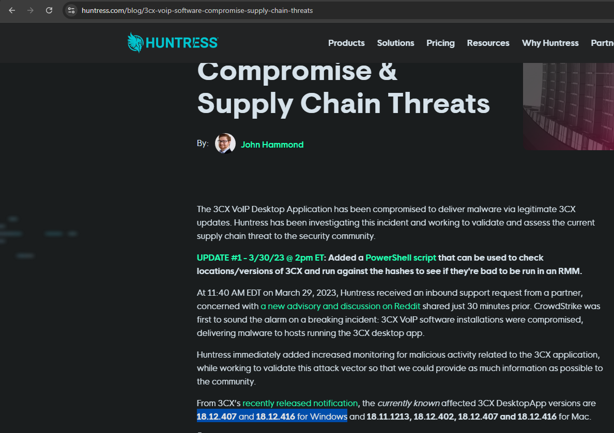

As shown in the image above, the article highlighted the specific versions associated with suspicious behavior and malware activity. This helped establish the scope of the compromise before moving into deeper malware analysis.

## Q2 - Finding the MSI Creation Time

After identifying the malicious version, I moved on to examining the MSI installer itself. Since MSI files contain metadata about installation packages, checking the creation timestamp helped establish part of the malware timeline.

To do this, I used the Linux `file` command against the MSI installer.

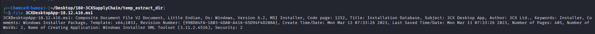

From the metadata output shown in the image above, I identified the MSI creation timestamp as:

`Mon Mar 13 06:33:26 2023 UTC`

This step helped show how even simple Linux utilities can reveal useful forensic metadata without requiring advanced tools. It also demonstrated how timestamps can help analysts correlate malware activity with known campaigns and incidents.

## Q3 - Identifying Malicious DLLs Dropped by the MSI

At this stage, the investigation shifted toward understanding what files were actually delivered by the MSI installer. Since MSI files can contain embedded streams and CAB archives, the next step was extracting those contents for analysis.

I first extracted the `product.cab` stream from the MSI using `msiinfo extract`, then created a separate analysis folder to keep the extracted files organized before unpacking the CAB archive using `7z`.

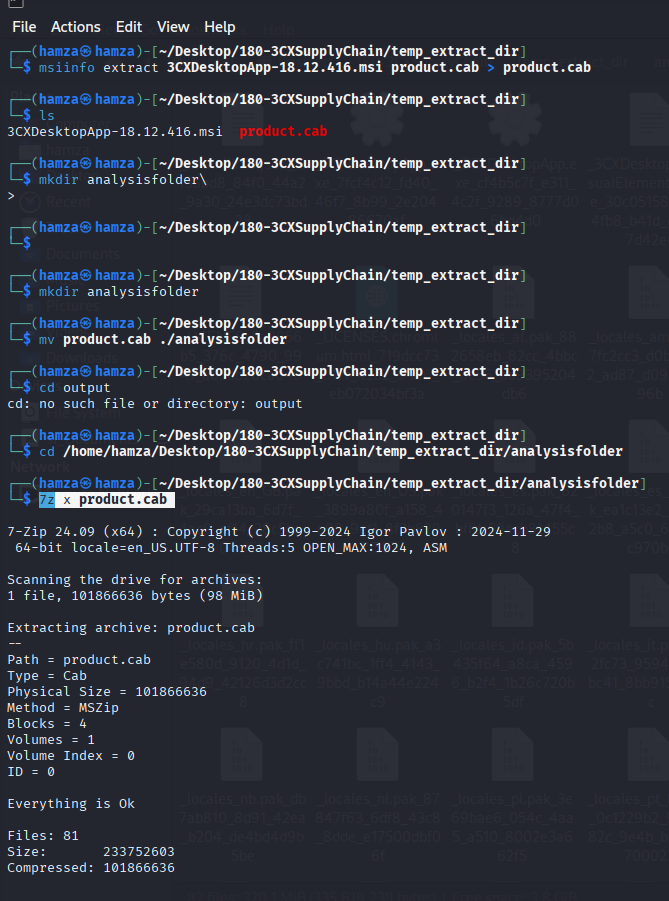

As shown in the image above, I extracted the embedded CAB archive and unpacked its contents to reveal the files stored inside the installer. This was important because the malicious payloads themselves were hidden within the installer package rather than being visible directly from the MSI metadata.

Once the files were extracted, I searched specifically for DLL files using the following command:

```bash
find . -type f -name "*.dll*" -exec sha256sum {} \;
```

This recursively searched for DLL files and immediately generated SHA256 hashes for each one found.

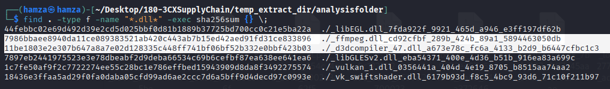

From the hashes shown in the image above, I identified multiple DLL files and submitted their hashes to VirusTotal for verification. Two DLLs were flagged as malicious:

- `ffmpeg.dll`
- `d3dcompiler_47.dll`

The VirusTotal results for `ffmpeg.dll` showed multiple detections associated with trojan activity and supply chain malware behavior.

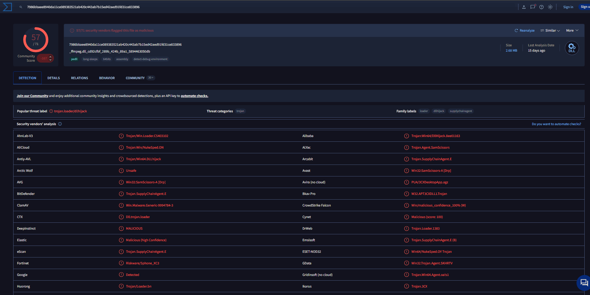

The second DLL, `d3dcompiler_47.dll`, was also flagged as malicious and associated with the same attack chain.

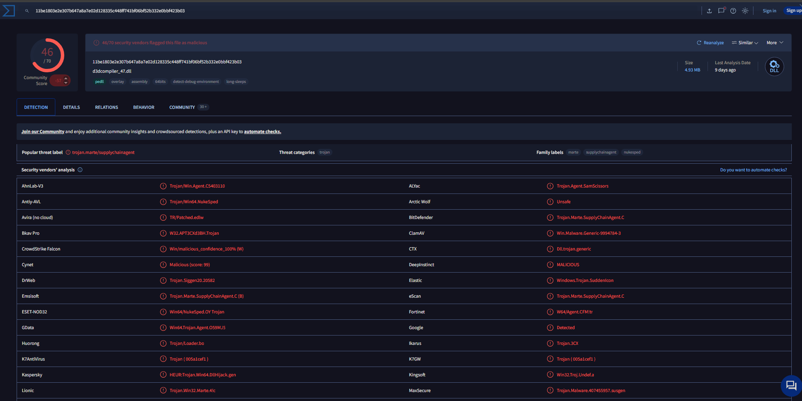

This part of the investigation showed how attackers can abuse legitimate installation packages to deliver malicious payloads while blending in with trusted software. It also reinforced why extracting and analyzing dropped DLLs is important during malware investigations.

## Q4 - Identifying the MITRE Technique Used for DLL Loading

After identifying the malicious DLLs, the next step was understanding how they were executed by the compromised application. Since the attack involved malicious DLLs being loaded by a legitimate application, I looked into MITRE ATT&CK techniques related to DLL hijacking and execution flow manipulation.

The MITRE ATT&CK page shown below identified the technique used as:

`T1574.002 – Hijack Execution Flow: DLL Search Order Hijacking`

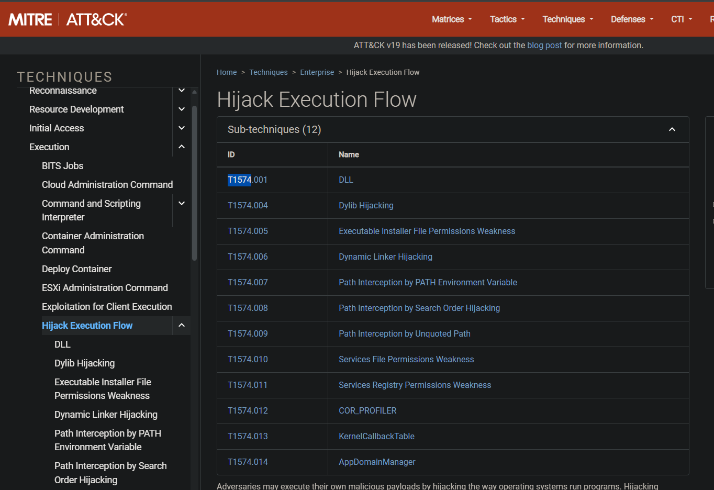

As shown in the image above, this technique involves placing malicious DLLs where trusted applications will load them automatically. In this attack, the legitimate 3CX application loaded the malicious DLLs during execution, allowing the malware to run under the context of a trusted process.

This step helped connect the malware behavior to a documented ATT&CK technique rather than just treating it as an isolated malware sample.

## Q5 - Identifying the Malware Category

After confirming the DLLs were malicious, I reviewed the VirusTotal detections and malware classifications associated with both DLLs.

The detections categorized both files as trojans, specifically acting as supply chain trojans or trojan loaders.

This classification made sense because the DLLs were not standalone ransomware or worms. Instead, they acted as malicious payloads delivered through a trusted software update process to enable further compromise and execution.

## Q6 - Identifying the Sandbox Evasion MITRE Technique

The next part of the investigation focused on anti-analysis and virtualization evasion behavior. Malware often checks whether it is running inside a sandbox or virtual machine before fully executing its payload.

From the MITRE ATT&CK references shown below, I identified the relevant technique as:

`T1497 – Virtualization/Sandbox Evasion`

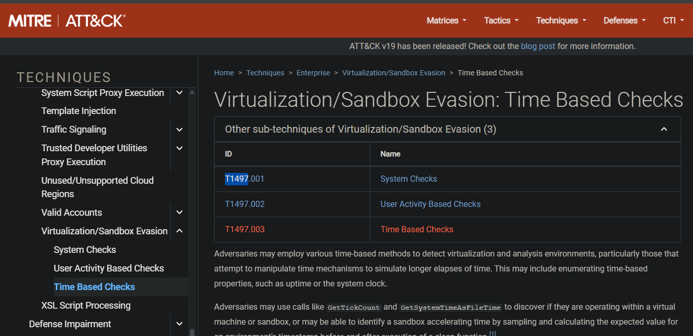

As shown in the image above, this technique involves malware attempting to detect analysis environments to avoid being studied or reverse engineered. This helps attackers hide malicious behavior from automated malware analysis systems.

This part of the lab showed how modern malware often includes defensive logic to protect itself from researchers and security tools.

## Q7 - Identifying the Targeted Hypervisor

While reviewing the anti-analysis behavior associated with `ffmpeg.dll`, I found references to VMware-related system checks.

The MITRE ATT&CK tree shown below highlighted virtualization checks targeting VMware environments.

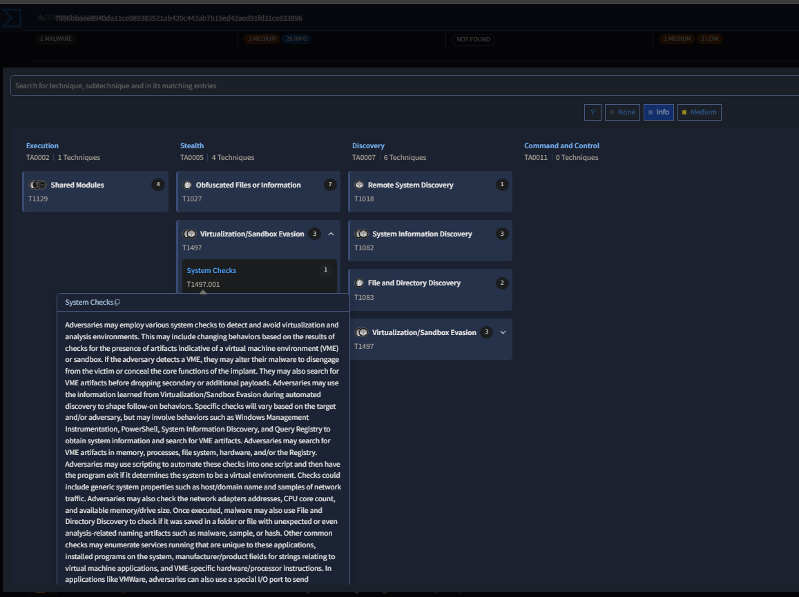

From the image above, I identified that the malware specifically targeted:

`VMware`

This means the malware checked for artifacts associated with VMware virtual machines before continuing execution. If detected, malware can terminate, hide functionality, or behave differently to avoid detection.

This reinforced how attackers actively try to evade malware analysts and sandbox systems during investigations.

## Q8 - Identifying the Encryption Algorithm

Next, I investigated the encryption techniques used by the malware. Malware commonly uses encryption to hide payloads, obfuscate strings, or secure communication with command-and-control servers.

From the VirusTotal behavior and MITRE references, I identified the encryption algorithm used as:

`RC4`

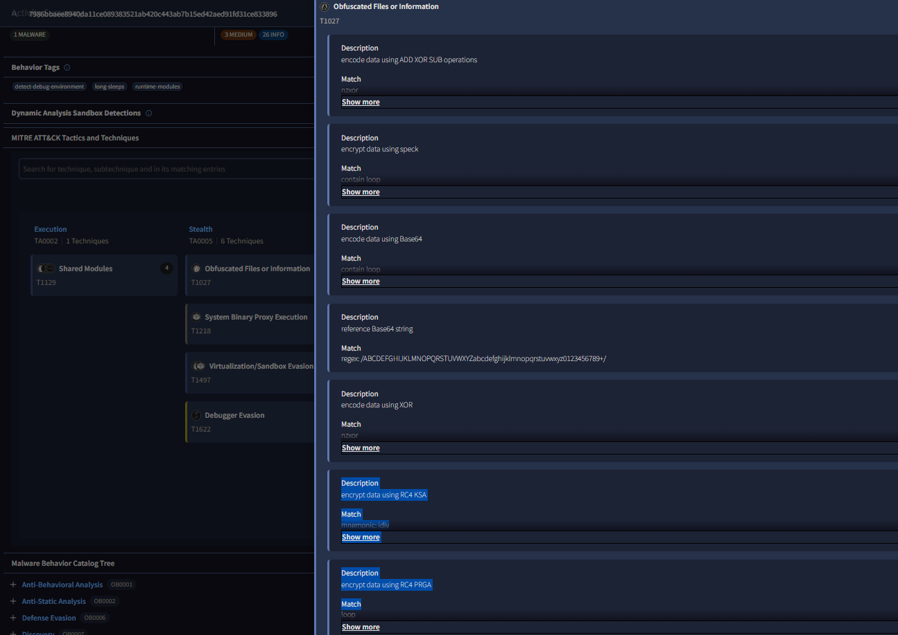

As shown in the image above, the malware used RC4 stream cipher encryption techniques. Although RC4 is considered outdated for secure communications, it is still frequently used in malware because it is lightweight and easy to implement.

This step demonstrated how encryption is often used in malware not necessarily for strong security, but to complicate analysis and detection.

## Q9 - Identifying the Threat Actor

The final stage of the investigation focused on attribution. After reviewing the malware behavior, DLL hijacking techniques, RC4 usage, and anti-analysis behavior, I investigated which threat actor was associated with the campaign.

The article shown below linked the attack to the Lazarus Group.

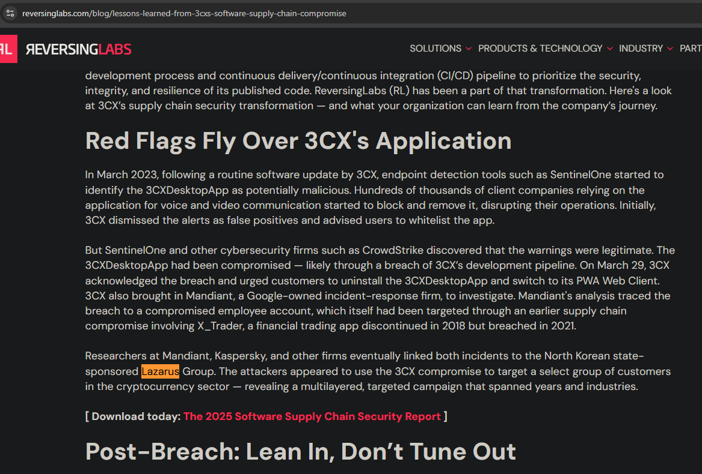

As shown in the image above, multiple security vendors associated the 3CX supply chain compromise with Lazarus, a North Korean state-sponsored threat group known for sophisticated malware operations and supply chain attacks.

This helped tie together the technical findings with a real-world threat actor and demonstrated how TTPs are used during threat intelligence investigations for attribution purposes.

## Conclusion

This lab provided a practical walkthrough of how supply chain malware investigations are performed in real-world scenarios. Instead of only identifying malicious files, the investigation involved understanding how the malware was delivered, how it executed, how it avoided analysis, and how researchers attributed the campaign to a known threat actor.

From this lab, I strengthened practical skills in:

- Malware analysis
- DLL and MSI investigation
- Hash analysis using SHA256
- Threat intelligence research
- MITRE ATT&CK technique mapping
- Identifying sandbox and VM evasion behavior

Overall, the lab showed how modern malware investigations involve connecting multiple smaller findings together rather than relying on a single indicator. It also reinforced how trusted software can become a delivery mechanism for large-scale compromises through supply chain attacks.
