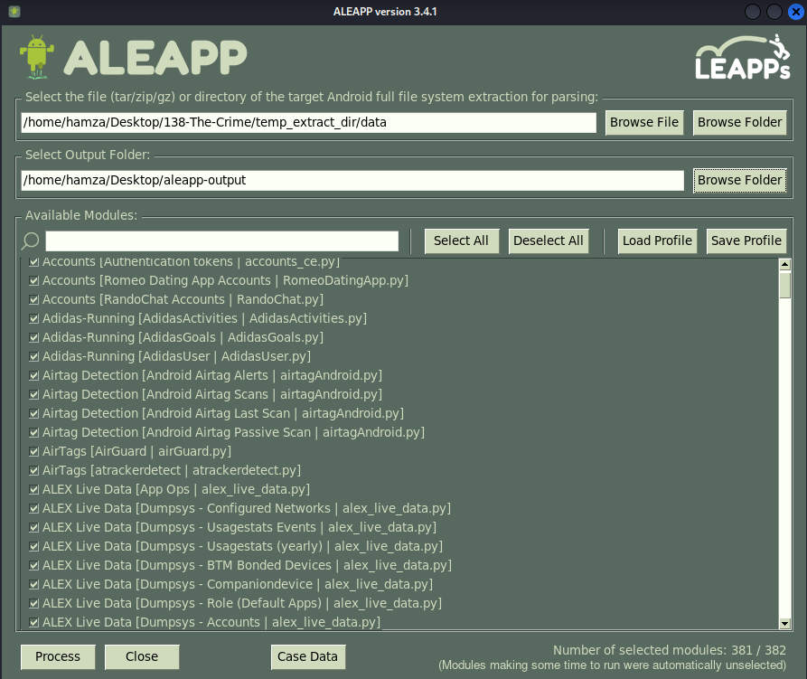
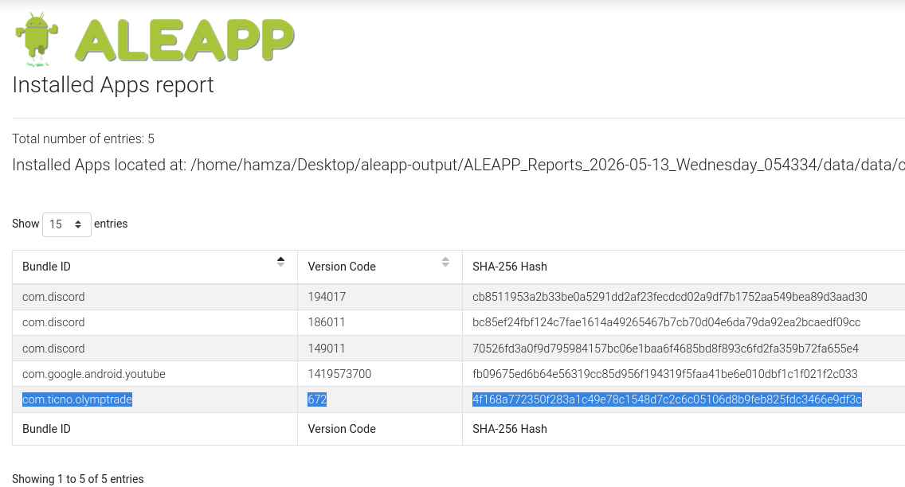
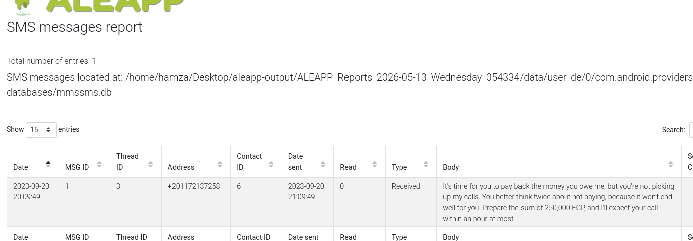
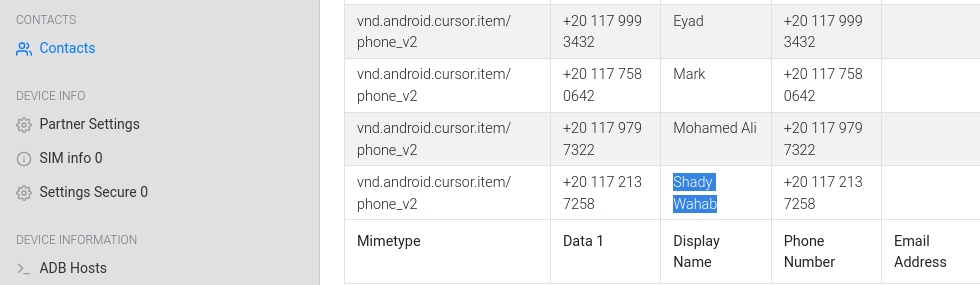
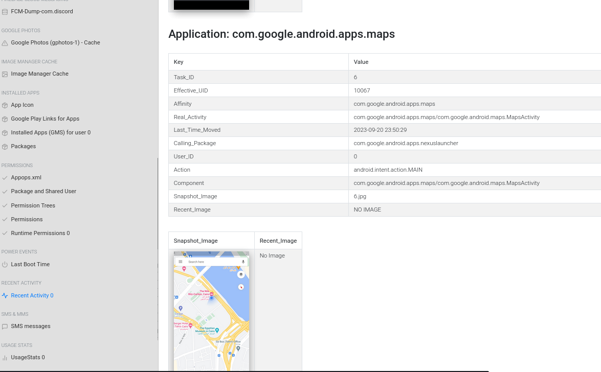
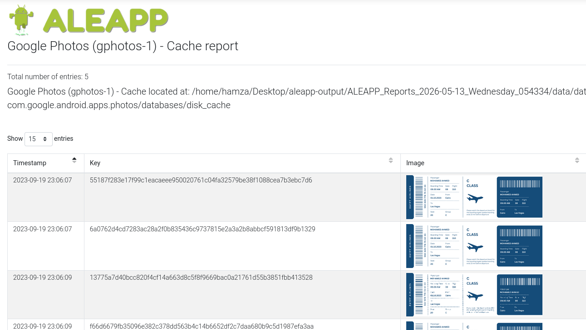
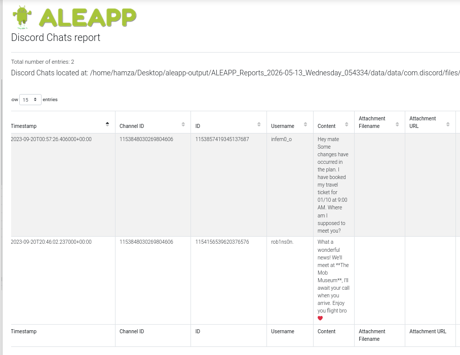

# The Crime Lab Mobile Forensics Write-up

## Introduction

In this lab, I investigated an Android device belonging to a victim involved in a murder case. The goal was to reconstruct the victim’s activity before the incident by analyzing artifacts extracted from the phone. To do this, I used ALEAPP on Kali Linux to parse the Android filesystem and generate forensic reports containing application data, SMS messages, contacts, GPS activity, Discord conversations, and other useful artifacts.

Instead of manually digging through databases and directories, ALEAPP made the investigation much easier because it organized the evidence into categories that could be reviewed step by step. Throughout the investigation, I correlated multiple artifacts together to understand the victim’s financial situation, movements, and travel plans.

## Setting Up ALEAPP

I first installed and launched ALEAPP GUI on Kali Linux. Since the evidence provided was already an extracted Android filesystem, I selected the extracted phone data as the input and created a separate output folder for the generated reports.

As shown in the image above, I configured ALEAPP to process the Android filesystem and generate a full forensic report. This report later became the main source for answering all investigation questions because it categorized the extracted artifacts into sections such as installed applications, SMS messages, contacts, Discord chats, recent activities, and more.

## Q1 - Identifying the Trading Application SHA256

The first task mentioned that the victim was heavily involved in trading and had accumulated debt. Based on that, the Installed Applications section was the most logical place to start because Android devices keep records of installed applications along with metadata such as package names, versions, and hashes.

Inside the Installed Applications report, I searched for anything related to trading applications and found the package:

`com.ticno.olymptrade`

This clearly matched the story surrounding the victim’s financial situation.

From this section, I was able to identify the SHA256 hash associated with the application:

`4f168a772350f283a1c49e78c1548d7c2c6c05106d8b9feb825fdc3466e9df3c`

This showed how useful installed application artifacts can be during investigations because they reveal not only what applications a user had, but sometimes even their interests, habits, or financial activity.

## Q2 - Finding the Debt Amount

The next clue stated that the victim had been avoiding calls from someone he owed money to. Since this involved communication, the SMS Messages section was the obvious place to investigate.

After opening the SMS report, I reviewed the conversations until I found a threatening message demanding repayment.

The message mentioned that the victim owed:

`250,000 EGP`

The sender also warned the victim about avoiding calls and demanded payment quickly. This immediately connected back to the witness statement about the victim being under financial pressure.

This part of the investigation showed how valuable SMS artifacts are because even a single message can reveal motive, relationships, and ongoing conflicts.

## Q3 - Identifying the Person Owed Money

Once I had the sender’s phone number from the SMS message, the next step was to identify who owned it. The Contacts section was the best place to continue because Android devices store saved contacts along with names and phone numbers.

I searched for the same number found in the SMS messages and located the matching contact entry.

The number belonged to:

`Shady Wahab`

This step was fairly straightforward, but it also showed how important correlation is in forensic analysis. Individually, the SMS and contact records only provide partial information, but combining them allowed me to directly connect the threatening messages to a real person.

## Q4 - Determining the Victim’s Location

The investigation then shifted toward identifying where the victim went before disappearing. Since this involved movement and location data, I checked the Recent Activity section generated by ALEAPP.

Inside this section, I found Google Maps activity linked to September 20, 2023. Scrolling further revealed a snapshot captured from the Google Maps application itself.

The screenshot showed the location:

`The Nile Ritz-Carlton, Cairo`

The timestamps also matched the timeline provided by the victim’s family. This was a good reminder that Android devices constantly store small traces of user activity, and even temporary app snapshots can become useful evidence during investigations.

## Q5 - Finding the Intended Travel Destination

The next clue suggested the victim had booked a flight after staying at the hotel. To investigate this, I started looking through communication-related artifacts because people often discuss travel plans through messaging applications.

While reviewing the reports, I found stored flight ticket images and related cached data indicating a planned trip.

From this information, I determined that the victim intended to travel to:

`Las Vegas, Nevada`

At this point, the case was starting to connect together more naturally. The victim’s location at the hotel, the travel plans, and the conversations found later all aligned with the same timeline.

## Q6 - Finding the Meeting Location

To continue tracing the victim’s plans, I moved into the Discord chat reports because messaging applications usually contain direct conversations about meetings, travel, and personal arrangements.

Inside the Discord report, I found a conversation with a user named:

`rob1ns0n`

During the conversation, they discussed meeting at a specific location.

The chat clearly mentioned:

`The Mob Museum`

This confirmed the exact meeting location arranged by the victim and his contact. Since The Mob Museum is located in Las Vegas, it also reinforced the travel evidence discovered earlier.

## Conclusion

This lab was a good example of how different Android artifacts can be combined to reconstruct a timeline of events. Instead of relying on a single piece of evidence, the investigation required correlating multiple sources together, including installed applications, SMS messages, contacts, GPS activity, cached images, and Discord conversations.

Using ALEAPP made the investigation much more organized because the artifacts were already categorized into sections that could be reviewed logically depending on the question being investigated. Throughout the lab, I learned how mobile forensic analysis is often less about finding one hidden file and more about connecting small pieces of information together until the overall picture starts to make sense.

The lab also helped me strengthen practical skills in:
- Android mobile forensics
- ALEAPP forensic analysis
- Artifact correlation
- Timeline reconstruction
- Communication analysis
- Investigating extracted mobile data
