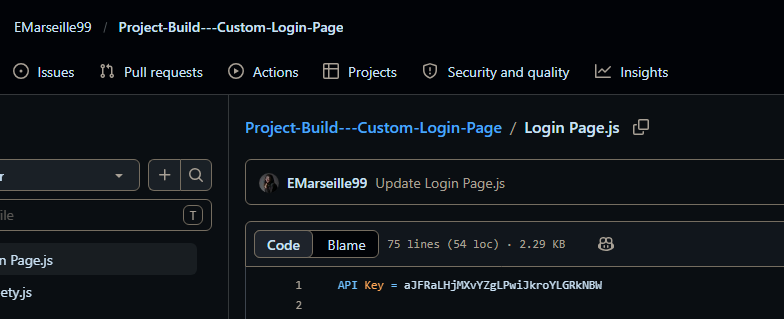
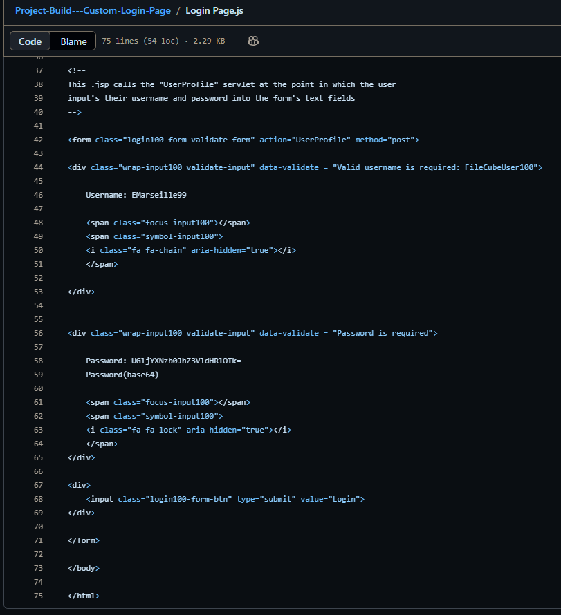
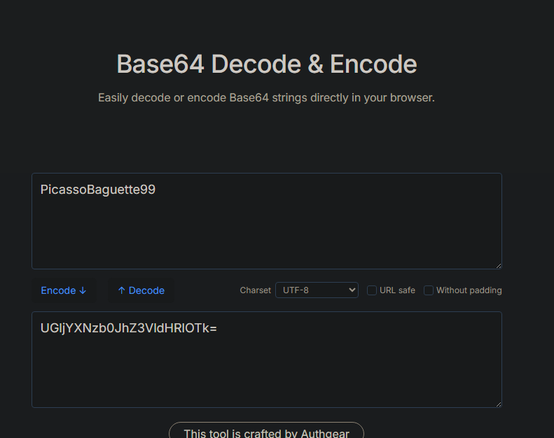
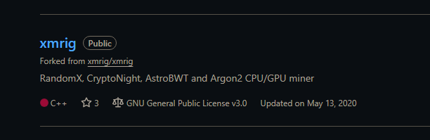
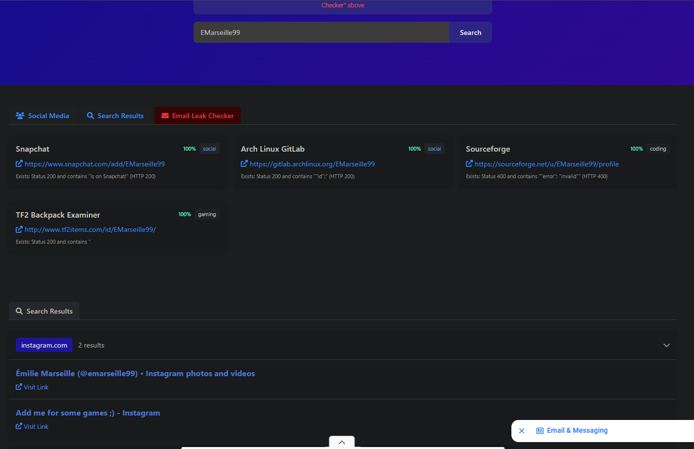
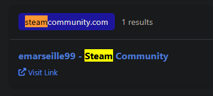
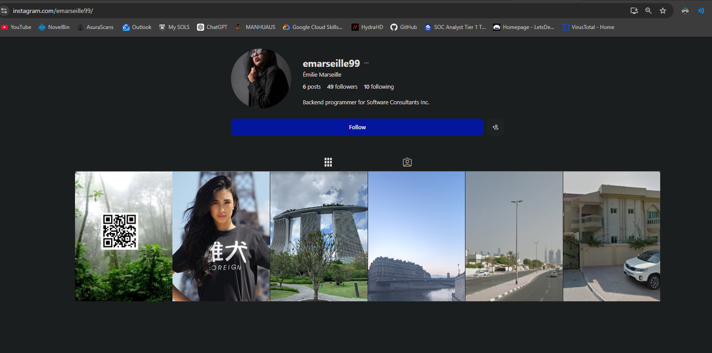
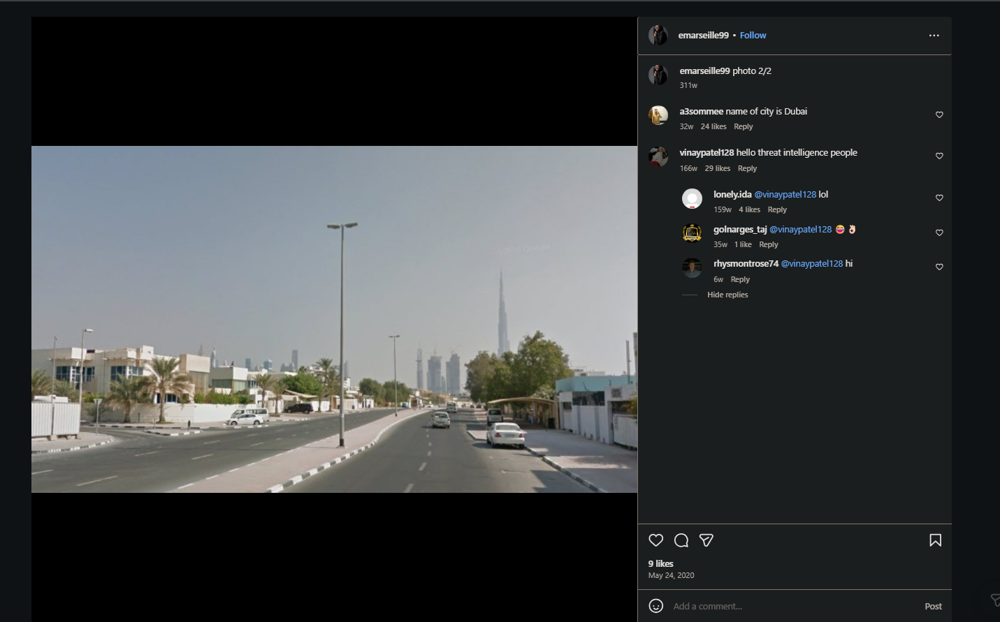

# Lespion OSINT Investigation Lab – CyberDefenders

## Lab Information

**Category:** OSINT / Threat Intelligence / Investigation  

This lab focused on investigating an insider threat using open-source intelligence techniques. The objective was to identify the insider responsible for compromising the company network and uncover information related to their online presence, exposed credentials, social media activity, cryptocurrency mining activity, and physical locations.

The investigation involved using multiple OSINT techniques including username enumeration, GitHub analysis, reverse image searching, social media investigation, and decoding exposed credentials.

# Q1 – Identifying the Exposed API Key

The investigation began by reviewing the insider’s GitHub repositories to identify any exposed sensitive information.

From the GitHub repository contents, we identified the exposed API key:

`aJFRaLHjMXvYZgLPwiJkroYLGRkNBW`

# Q2 – Identifying the Plaintext Password

While reviewing the GitHub repository, an encoded password was discovered inside one of the files.

The value appeared to be Base64-encoded, so it was decoded using an online Base64 decoding tool.

After decoding the value, the plaintext password was identified as:

`PicassoBaguette99`

# Q3 – Identifying the Cryptocurrency Mining Tool

Further investigation into the insider’s GitHub repositories revealed a repository associated with cryptocurrency mining activity.

From the repository name and contents, we identified that the insider was using:

`XMRig`

as the cryptocurrency mining tool.

# Q4 – Identifying the Gaming Website Account

To identify additional online accounts associated with the insider, the username was searched using the WhatsMyName OSINT tool.

The results revealed multiple associated accounts, including a Steam profile.

From the Steam community profile discovery, we identified that the insider had an account on:

`Steam`

# Q5 – Identifying the Instagram Profile

The investigation then shifted toward identifying the insider’s social media presence.

From the Instagram profile page, the insider’s Instagram account was identified as:

`https://www.instagram.com/emarseille99/`

# Q6 – Identifying the Holiday Destination

The Instagram profile also contained travel-related posts that helped identify locations visited by the insider.

From the social media investigation, it was determined that the insider visited:

`Singapore`

during a holiday trip.

# Q7 – Identifying the Insider’s Family Location

One of the Instagram posts showed a skyline image that helped identify where the insider’s family lives.

From the skyline visible in the post, we identified the location as:

`Dubai`

# Q8 – Identifying the Company Office Location

The provided office image was analyzed to determine the city where the company office was located.

By searching the theater name visible in the image, the office location was identified as:

`Birmingham`

# Q9 – Identifying the Webcam Location

The final stage of the investigation involved identifying the location of an IP camera image provided by the intelligence team.

Using reverse image searching techniques, the image was linked to a university location in:

`Indiana`

# Conclusion

This investigation demonstrated how publicly exposed information across platforms such as GitHub, Instagram, Steam, and other online services can be correlated to build a detailed profile of an insider threat actor.

The workflow combined multiple OSINT techniques including username enumeration, credential analysis, reverse image searching, social media profiling, and repository analysis to uncover both technical and personal information related to the suspect. The investigation also highlighted how exposed credentials and publicly accessible social media activity can contribute significantly to threat intelligence and attribution efforts.
