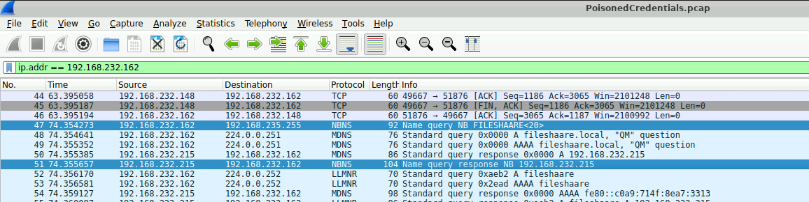
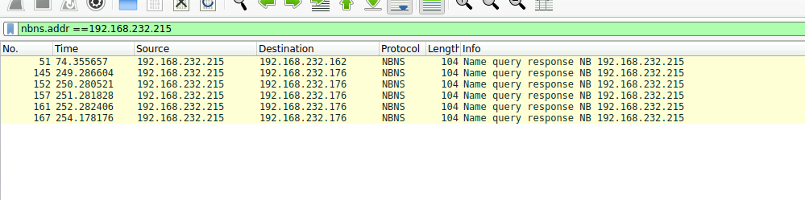
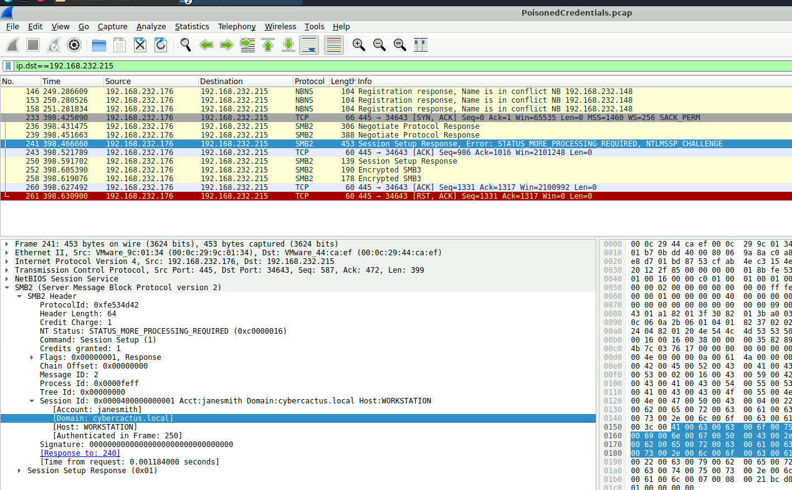
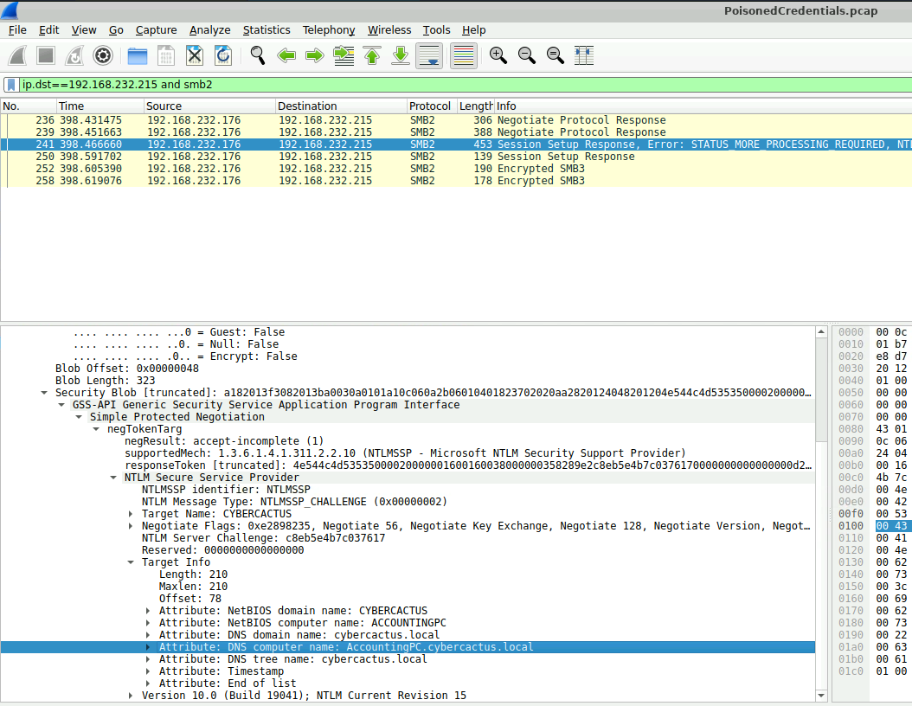

# PoisonedCredentials Lab Writeup

## Introduction

In this lab, we investigated a poisoning attack involving NBNS and SMB traffic inside a Windows environment. The goal was to trace how the attacker abused name resolution traffic to capture authentication attempts from victim machines. Using Wireshark, we followed the flow of the attack step by step, starting from the initial mistyped query all the way to identifying the compromised account and the machine the attacker targeted.

The walkthrough mostly focused on understanding how the poisoned responses worked and where the useful evidence could be found inside the packet details rather than just looking at the answers directly.

## Question 1 - Identifying the Mistyped Query and Rogue Machine



We started by filtering traffic related to the victim machine using:

```text
ip.addr == 192.168.232.162
```

From this image, we found an NBNS request packet being broadcast across the network. Looking at the highlighted query, we could see the mistyped share name:

```text
FILESHAARE<20>
```

The typo immediately stood out because it was clearly trying to access a file share but with an extra "A" in the name. Since NBNS broadcasts unresolved requests to the network, this creates an opportunity for attackers to respond pretending to be the correct host.

Using the same screenshot, we also identified the machine responding to the poisoned request. The response packet was coming from:

```text
192.168.232.215
```

This was the first indicator that the system was acting as the rogue machine in the poisoning attack because it responded directly to the mistyped broadcast query.

This step helped connect the whole attack flow early on because we first found the victim request, then immediately saw the suspicious system answering it.

## Question 2 - Identifying the Second Victim Machine



After identifying the rogue machine from the first screenshot, we then filtered traffic involving it using:

```text
nbns.addr == 192.168.232.215
```

From this image, we focused on the systems communicating with the rogue host through NBNS traffic.

As shown in the packet list, we found another machine receiving poisoned responses from the attacker. The second affected victim machine had the IP:

```text
192.168.232.176
```

This part of the investigation was useful because instead of only identifying the attacker, we started identifying how many systems were being targeted by the poisoning activity.

## Question 3 - Finding the Compromised Account



Here we narrowed the traffic down to packets being sent directly to the rogue machine using:

```text
ip.dst == 192.168.232.215
```

From the image, we selected an SMB2 packet that contained:

```text
Session Setup Response, Error: STATUS_MORE_PROCESSING_REQUIRED
```

That packet stood out because SMB authentication traffic usually contains NTLM negotiation information, which attackers try to capture during poisoning attacks.

Inside the packet details, we traversed through:

```text
SMB2
└── Session ID
```

From there, we found the compromised account details.

The username was:

```text
janesmith
```

and the domain was:

```text
cybercactus.local
```

What made this step interesting was seeing how authentication traffic exposes useful information once you know where to look inside the protocol structure.

## Question 4 - Finding the Hostname Accessed Through SMB



For the final part, we used the filter:

```text
ip.dst == 192.168.232.215 && smb2
```

Then we selected the same SMB2 authentication packet from the previous step.

This time, we expanded deeper into the NTLM challenge information using the following path:

```text
SMB2
└── Session Setup Response
    └── Security Blob
        └── GSS-API Generic Security Service
            └── Simple Protected Negotiation
                └── negTokenTarg
                    └── NTLM Secure Service Provider (NTLMSSP)
                        └── Target Info
```

Inside the `Target Info` section, we found the attribute:

```text
DNS Computer Name
```

which revealed the hostname:

```text
AccountingPC.cybercactus.local
```

This confirmed the specific machine the attacker was interacting with over SMB.

This step tied the whole investigation together because it showed how NTLM authentication traffic can expose both user and host information during poisoning attacks.

## Conclusion

This lab gave a really solid understanding of how NBNS poisoning and SMB credential interception actually look in real packet captures instead of only reading about them theoretically. Following the traffic step by step made it easier to understand how attackers abuse broadcast protocols and capture NTLM authentication attempts.

Some of the most useful skills learned from this lab were:

- Investigating NBNS poisoning attacks in Wireshark
- Tracing rogue hosts through broadcast traffic analysis
- Analyzing SMB2 and NTLM authentication traffic
- Traversing protocol layers efficiently inside packet captures
- Identifying compromised usernames and hostnames from NTLM challenge data

The lab also helped improve packet analysis workflow because most of the investigation came from understanding where information is stored inside protocols rather than relying only on filters.

Official walkthrough reference: :contentReference[oaicite:0]{index=0}
