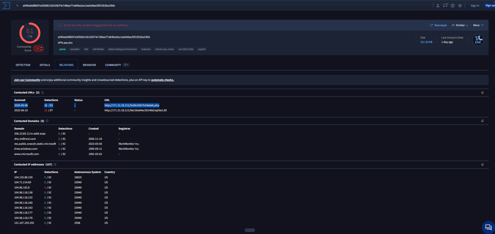
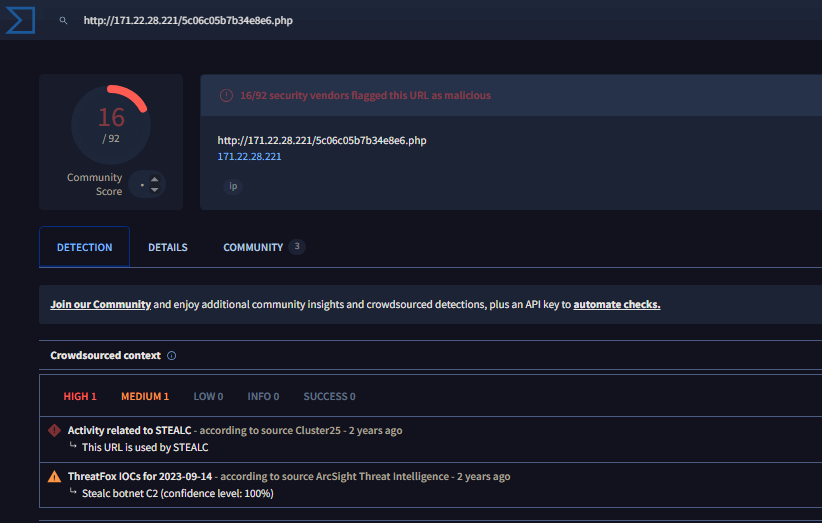
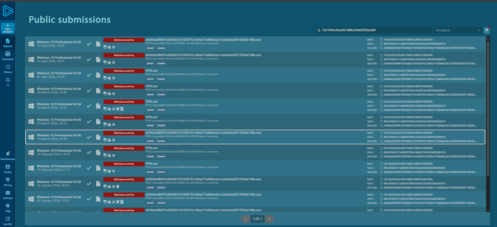
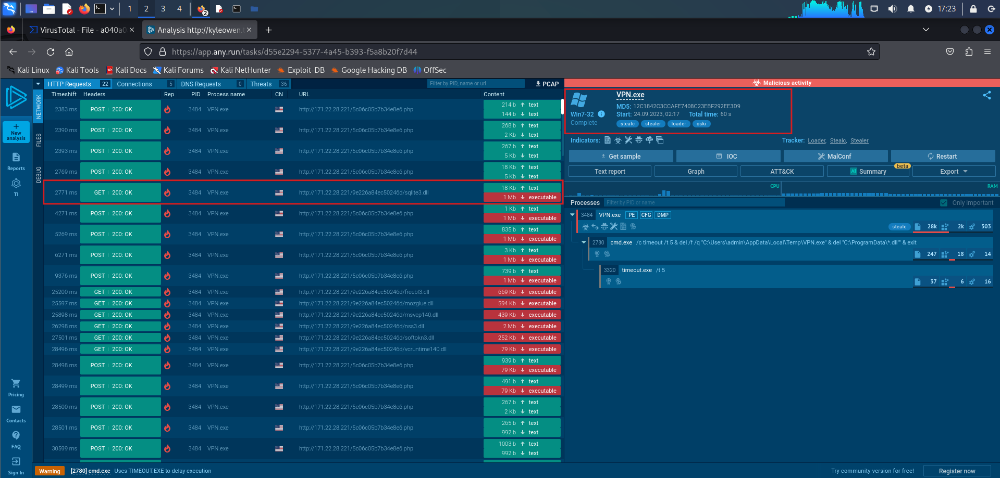
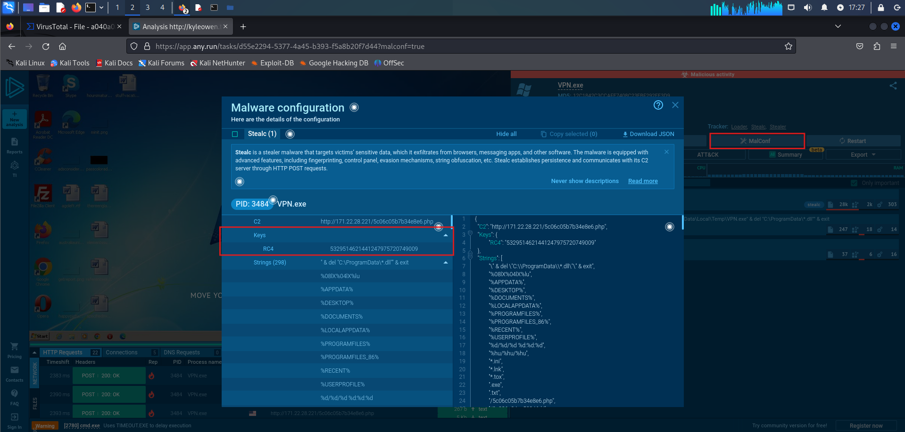
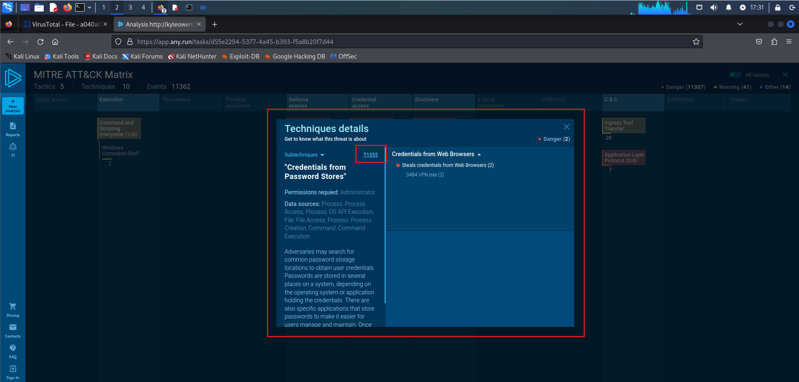
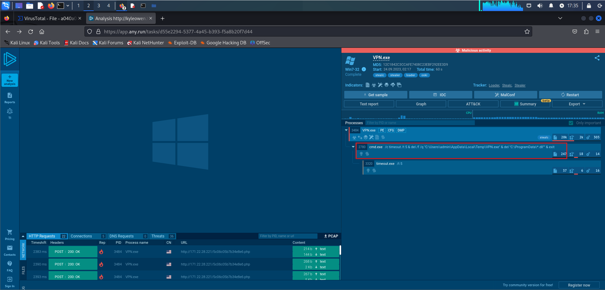

# OSKI Malware Analysis Lab – CyberDefenders

## Lab Information

This lab focused on analyzing a malicious PowerPoint-related malware sample using VirusTotal and ANY.RUN. The investigation involved identifying the malware creation time, command and control (C2) infrastructure, network activity, malware configuration data, credential theft techniques, and post-exploitation behavior.

The analysis followed a step-by-step workflow based on the lab questions, starting with threat intelligence gathering and then moving into behavioral analysis using sandbox reports.

# Q1 – Determining the Malware Creation Time

The first step was identifying when the malware sample was created. To begin the investigation, the malware hash was searched in VirusTotal. After reviewing the sample information and metadata, the malware creation timestamp was identified.

The malware creation timestamp was:

`2022-09-28 17:40`

While reviewing the VirusTotal report, the Relations tab also revealed an external HTTP communication associated with the malware sample. This led to the identification of the command and control infrastructure used by the malware.

The identified C2 server was:

`http://171.22.28.221/5c06c05b7b34e8e6.php`

To verify that the URL was actually malicious infrastructure related to the malware, the URL was searched separately in VirusTotal to confirm its association with C2 activity.

The additional search confirmed that the identified IP and PHP endpoint were associated with malicious communication activity.

# Q2 – Identifying the First Requested Library

The malware hash was then investigated in ANY.RUN to analyze its runtime behavior and sandbox reports.

The first step was searching the hash inside ANY.RUN to review available analysis sessions.

After opening one of the sandbox reports, the network activity and process behavior were analyzed. Within the report, the malware’s initial DLL request was identified.

The first library requested by the malware after infection was:

`sqlite3.dll`

The network tab showed the malware communicating with the previously identified C2 server while also revealing the initial DLL request behavior.

# Q3 – Extracting the RC4 Key

From the MalConf section inside the ANY.RUN sandbox report, we found that the malware used the following RC4 key to decrypt its base64-encoded strings:

`5329514621441247975720749009`

# Q4 – Identifying the MITRE ATT&CK Credential Theft Technique

From the MITRE ATT&CK techniques shown in the sandbox report, we can see that the malware used technique `T1555` for credential theft and password extraction.

# Q5 – Identifying the Targeted Directory and Self-Deletion Delay

From the process tree and child process activity, we found that the malware targeted the directory:

`C:\ProgramData`

for DLL deletion activity.

The same process execution also showed that after successfully exfiltrating data, the malware waited:

`5 seconds`

before deleting itself from the system.

# Conclusion

This lab focused on combining threat intelligence with behavioral malware analysis. Instead of relying on only one source, the investigation moved between VirusTotal and ANY.RUN to correlate indicators, network communication, process activity, and malware configuration data.

The workflow made it easier to follow how the malware operated from initial execution all the way to credential theft, data exfiltration, cleanup activity, and self-deletion. Reviewing the MITRE ATT&CK mappings alongside the sandbox behavior also helped connect the observed activity to real-world adversary techniques rather than just isolated indicators.
